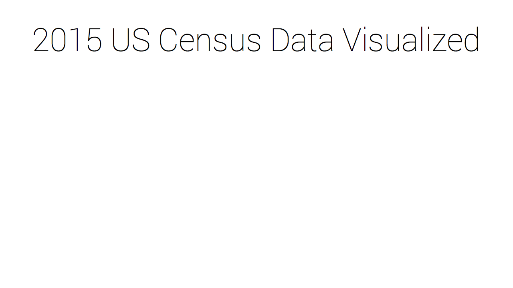
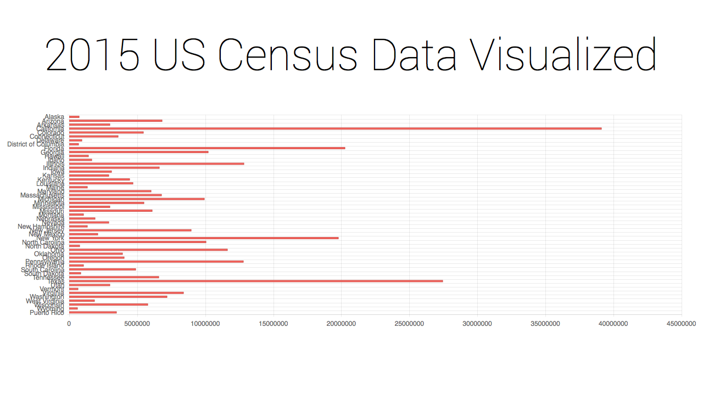
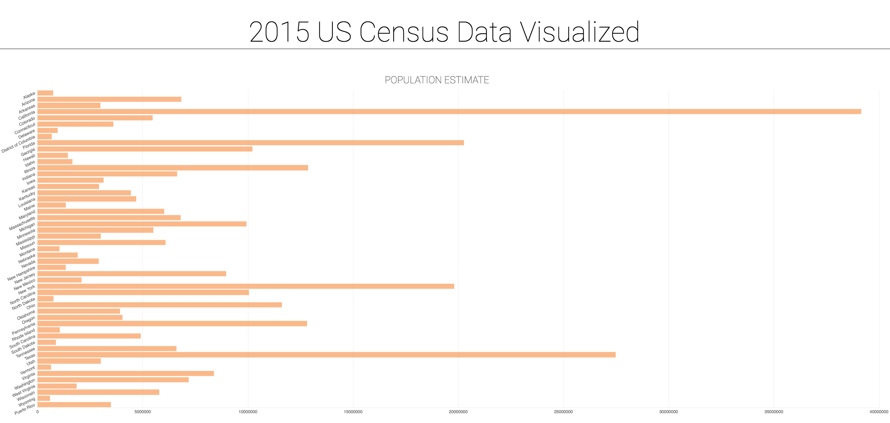

# Visualizing Data with Kendo UI for Angular 2

Recently, I've been very interested in the demographics of the United States. When someone asked me for the population in Ohio, I replied, "Lots of millions? Wait. Siri, what's the population of Ohio?" As you will see, the population of Ohio according to the 2015 Census is around 11.59 million. Although Google and Siri are helpful with the quick stats I wanted to be able to wrap my mind around the population and population changes for each state. In order to do that I used the handy-dandy [2015 Census results](https://www.census.gov/popest/data/national/totals/2015/) and was able to quickly render up some visualizations using Kendo UI for Angular 2. I'll walk you through that process now but feel free to check out the [repo](https://github.com/tzmanics/ng2-kendo-visualizations) and the [website](http://tzmanics.com/kendoui-ng2-census-visualizations/).

## Setting Up the Project
___

To get started, we need to create an Angular 2 project that will provide a project structure. For this example, you'll need to have the [Angular CLI](https://github.com/angular/angular-cli) installed and the Progress npm registry configured for use on your machine. Check out our fantastic [Getting Started](http://www.telerik.com/kendo-angular-ui/getting-started/) guide that walks you through the steps to get this set up. Once your machine is ready, navigate to the directory where you would like your project to live and enter the `ng new` command with your project name:

```bash
cd angular-projects
ng new kendoui-ng2-census-visualizations
```

This command will scaffold a directory structure that contains all of your project's files:

```bash
installing ng2
  create .editorconfig
  create README.md
  create src/app/app.component.css
  create src/app/app.component.html
  create src/app/app.component.spec.ts
  create src/app/app.component.ts
  create src/app/app.module.ts
  create src/app/index.ts
  create src/assets/.gitkeep
  create src/environments/environment.prod.ts
  create src/environments/environment.ts
  create src/favicon.ico
  create src/index.html
  create src/main.ts
  create src/polyfills.ts
  create src/styles.css
  create src/test.ts
  create src/tsconfig.json
  create src/typings.d.ts
  create angular-cli.json
  create e2e/app.e2e-spec.ts
  create e2e/app.po.ts
  create e2e/tsconfig.json
  create .gitignore
  create karma.conf.js
  create package.json
  create protractor.conf.js
  create tslint.json
Successfully initialized git.
Installing packages for tooling via npm.
Installed packages for tooling via npm.
```

For this example, we'll only modify `src/styles.scss` and a few files in the `src/app` directory.

*Personally, this is where I like to [initiate my git repo](https://help.github.com/articles/adding-an-existing-project-to-github-using-the-command-line/) for a project. Sure, it's the very beginning and an easy point to recreate but this gets the habit of committing fresh in the brain.*

### Add Base Styling and Core Layout

Kendo UI for Angular 2 provides two main options to include the Kendo UI theme in your project. We can either use a precompiled theme that styles all components, or load the theme source files through Webpack to modify and customize its styles. For this example, we'll add Kendo UI's default styling to get things styled right off the bat. Then, we'll add a `<h1>` and a few placeholder `<div>` elements.

First, we need to install (`i`) the module containing the default theme of Kendo UI for Angular 2 and save it to out `package.json` dependency list (`-S` or `--save`).

```bash
npm i @telerik/kendo-theme-default -S
```

Once the package is installed, we need to update our `src/styles.scss` file to utilize its styles. This is done by adding a new `font-family` property and changed some styling for the `<h1>` to show how you add custom styling:

`src/styles.css`
```css
@import "~@telerik/kendo-theme-default/styles/packages/all";
@import url('https://fonts.googleapis.com/css?family=Roboto:100');

// you can enter custom SCSS below
h1 {
  font-family: 'Roboto', sans-serif;
  text-align: center;
  font-size: 5em;
  font-weight: 100;
}
```

Next, We'll add a header and some `<div>` elements to `src/app/app.component.ts`. Ideally, we would have component files for each one of our visualizations to keep them modular and to prevent `app.component.ts` from growing too large. For now, we'll just keep it in one file to make it quick and easy:

`src/app/app.component.ts`
```ts
@Component({
  selector: 'app-root',
  styleUrls: ['./app.component.scss'],
  template: `
    <h1>2015 US Census Data Visualized</h1>
    <div class="visualization"></div>
    <div class="visualization"></div>
    <div class="visualization"></div>
  `
})
```
I always like to run `ng serve` from the projects directory at each step just to makes sure everything is hunky-dory. That way, *when* things go wrong, I know where to start debugging. At this point, the page is looking rather bare:



You can see the changes made in this section by looking at [this commit in the repo](https://github.com/tzmanics/kendoui-ng2-census-visualizations/commit/30dd967267c24fbb0a136fc9d65e4fe4f7ffbdc6).

## Build the Visualization
___
### Get the Data

For these visualizations, we'll use an array of objects for our data. This is the most common way of [binding your data](http://www.telerik.com/kendo-angular-ui/components/charts/chart/data-binding/#objects) because we can set our model and don't have to modify our data. The census data came as a CSV file so I opened the file up, made smaller data sets with the info I wanted, and saved those as individual CSV files. In order to easily convert them to JSON, I used Martin Drapeau's [CSV to JSON site](http://www.csvjson.com/csv2json). There are lots of modules to do this or you could write your own little script but that was the fastest resource. 😊

### Add Chart Module and Components

Now we're ready to start visualizing some data! First, We'll install the chart module and save it the project's dependencies:

```bash
npm i @progress/kendo-angular-charts@0.9.1 -S
```

Once installed, we can use the charts module in our project:

`src/app/app.module.ts`
```ts
import { BrowserModule } from '@angular/platform-browser';
import { NgModule } from '@angular/core';
import { FormsModule } from '@angular/forms';
import { HttpModule } from '@angular/http';

import { AppComponent } from './app.component';
import { ChartsModule } from '@progress/kendo-angular-charts';

@NgModule({
  declarations: [
    AppComponent
  ],
  imports: [
    BrowserModule,
    FormsModule,
    HttpModule,
    ChartsModule
  ],
  providers: [],
  bootstrap: [AppComponent]
})

export class AppModule { }
```

In `src/app/app.component.ts`, we'll add the tags to the component to create the visualization. First, we'll add the selector for the chart (`kendo-chart`) as well as the selectors for its data (`kendo-chart-series` and `kendo-chart-series-item`).

Selectors like `kendo-chart-series-item` and `kendo-chart-value-axis-item` (we haven't used that one yet, but we will 😁), must be nested within their parent (i.e. `kendo-chart-series-item` must go inside `kendo-chart-series` which must live in `kendo-chart`). We're basically climbing down the tree. Here's what that looks like in the code:

`src/app/app.component.ts`
```ts
@Component({
  selector: 'app-root',
  styleUrls: ['./app.component.scss'],
  template: `
    <h1>2015 US Census Data Visualized</h1>
    <div class="visualization">
      <kendo-chart>
        <kendo-chart-series>
          <kendo-chart-series-item>
          </kendo-chart-series-item>
        </kendo-chart-series>
      </kendo-chart>
    </div>
    <div class="visualization"></div>
    <div class="visualization"></div>
  `
})
```

To add data, we'll have to add some inputs into our `kendo-chart-series-item` selector so it knows how to get and handle our data. You can check out the whole [API documentation on this component](http://www.telerik.com/kendo-angular-ui/components/charts/api/SeriesItemComponent/) but here is the list of the inputs we'll be using now:

* `type`: the series type visualization we want (we'll be using `bar` but check out all the [different series types](http://www.telerik.com/kendo-angular-ui/components/charts/chart/series-types/)!)
* `data`: the data (inline) or a reference (I recommend looking at [the details](http://www.telerik.com/kendo-angular-ui/components/charts/chart/series-types/) to get a thorough understanding)
* `field`: the value of the data item
* `category`: contains the category (the points will be rendered in chronological order if it's a date)

`src/app/app.component.ts`
```ts
@Component({
  selector: 'app-root',
  styleUrls: ['./app.component.scss'],
  template: `
    <h1>2015 US Census Data Visualized</h1>
    <div class="visualization">
      <kendo-chart>
        <kendo-chart-series>
          <kendo-chart-series-item
            type="bar" [data]="populationData"
            field="population" categoryField="state">
          </kendo-chart-series-item>
        </kendo-chart-series>
      </kendo-chart>
    </div>
    <div class="visualization"></div>
    <div class="visualization"></div>
  `
})
```

We've set the `data` input to `populationData`, so we'll need to create that object to bind it to the chart. To do this, we'll add it the `AppComponent` class:

`src/app/app.component.ts` *(at the bottom)*
```ts
export class AppComponent {
  private populationData: Model[] = [{
    "state": "Alaska",
    "population": 738432
  }, {
    "state": "Arizona",
    "population": 6828065
  }, {
    "state": "Arkansas",
    "population": 2978204
  }, {
    "state": "California",
    "population": 39144818
  }, {
    "state": "Colorado",
    "population": 5456574
  }, {
    "state": "Connecticut",
    "population": 3590886
  }];
}
```

I've only included 5 states to keep the code here short but you can either grab the gist of all the states [here](https://gist.github.com/tzmanics/9944e11fa398a828ff4046bb6f651dee) or you can view the whole whole file in the [repo](https://github.com/tzmanics/kendoui-ng2-census-visualizations/blob/master/src/app/app.component.ts).

In order for this data to be interpreted correctly we will need to declare the data's Model at the top of the file.

`src/app/app.component.ts` *(at the top)*
```ts
import { Component } from '@angular/core';

interface Model {
  state: string;
  population: number;
}

@Component({
...
```

Okay, with the data added you should be able to serve up your project and see a chart! Run `ng serve` and head on over to `http://localhost:4200/` in your browser. If you have added all the states information it will looked super squished BUT you do have a visualization 📊 🙌!



If you ran into an problems or you just want to see what we changed in this section you can check out the diff in [this commit](https://github.com/tzmanics/kendoui-ng2-census-visualizations/commit/1e4e3d44938d1f9d76a30899328604c9e072e30a). If you find yourself with a page that just says "Loading" you can also check the console to see if any errors are popping up.

### Style the Chart

We can change the styling within the chart selectors with different inputs. Let's step through each additional selector and the new inputs we've added to each of the selectors we already have in place. First, let's take a look at what the code will look like with all these changes.

`src/app/app.component.ts`
```ts
@Component({
  selector: 'app-root',
  styleUrls: ['./app.component.scss'],
  template: `
    <h1>2015 US Census Data Visualized</h1>
    <div class="visualization">
      <kendo-chart style="height: 1000px" >
        <kendo-chart-title
          text="POPULATION ESTIMATE"
          font="2em Roboto, Arial">
        </kendo-chart-title>
        <kendo-chart-series>
          <kendo-chart-series-defaults
            [gap]="0.25">
          </kendo-chart-series-defaults>
          <kendo-chart-series-item
            type="bar"
            [data]="populationData"
            field="population"
            categoryField="state"
            [opacity]="0.7"
            [color]="'#fb9b51'"
            [border]="{ color: '#fb9b51', opacity: 0.3 }">
          </kendo-chart-series-item>
        </kendo-chart-series>
        <kendo-chart-category-axis>
          <kendo-chart-category-axis-item
            [majorGridLines]="{ visible: false }"
            [majorTicks]="{ visible: false }"
            [labels]="{ rotation: '-25' }">
          </kendo-chart-category-axis-item>
        </kendo-chart-category-axis>
        <kendo-chart-value-axis>
          <kendo-chart-value-axis-item
            [max]="40000000"
            [majorTicks]="{ visible: false }">
          </kendo-chart-value-axis-item>
        </kendo-chart-value-axis>
      </kendo-chart>
    </div>
    <div class="visualization"></div>
    <div class="visualization"></div>
  `
})
```
In order to get rid of the squished look, we can increase the height of the whole chart component by editing the style of `kendo-chart` which was already in place.

```ts
<kendo-chart style="height: 1000px" >
```
We can then add a title to the chart. To do so we have to add and edit the selector for [the title component](http://www.telerik.com/kendo-angular-ui/components/charts/api/TitleComponent/), `kendo-chart-title`. To have it match the `h1` text we can change the font to `Roboto`.

```ts
<kendo-chart-title
  text="POPULATION ESTIMATE"
  font="2em Roboto, Arial">
</kendo-chart-title>
```

When we made the chart bigger the bars for each value of the data didn't change in height which left the data looking quite twiggy. To fix these we actually just need to change the size of the gap between each bar. This customizations lives in the `kendo-chart-series-defaults` [selector](http://www.telerik.com/kendo-angular-ui/components/charts/api/SeriesDefaultsComponent/) and we just set it to a number.

```ts
<kendo-chart-series-defaults
  [gap]="0.25">
</kendo-chart-series-defaults>
```

Although we already added some inputs on the `kendo-chart-series-item` we can tack on some more for styling the bars. In order to see the grid lines for each bar we can change the opacity of the bars, then change the color to be less partisan 😉 & change the border color as well to match. There is a ton more that you can do with the category axis item component &amp; you can find all that info in the [API](http://www.telerik.com/kendo-angular-ui/components/charts/api/SeriesItemComponent/). Yay!

```ts
<kendo-chart-series-item
  type="bar"
  [data]="populationData"
  field="population"
  categoryField="state"
  [opacity]="0.7"
  [color]="'#fb9b51'"
  [border]="{ color: '#fb9b51', opacity: 0.3 }">
</kendo-chart-series-item>
```

Next, we'll look at both of the axis items together. We'll remove the major grid lines from the category axis (the y-axis in this chart) because the bars for the series act as a guide well enough. We'll remove the tick marks for both axis because they seem unneeded BUT I highly recommend switching the boolean on these and testing them all for yourself! You can mess with all the other options for these axis too: [the category axis item](http://www.telerik.com/kendo-angular-ui/components/charts/api/CategoryAxisItemComponent/) & [the value axis item](http://www.telerik.com/kendo-angular-ui/components/charts/api/ValueAxisItemComponent/). We can also rotate the labels on the y-axis because...why not? Sometimes this may actually be necessary to fit the labels if you have long label names and/or limited space. The last thing we'll tweak is the max value of the x-axis. Since California has the largest population at 39144818, we'll go ahead and cap the value at 40000000.

```ts
<kendo-chart-category-axis>
  <kendo-chart-category-axis-item
    [majorGridLines]="{ visible: false }"
    [majorTicks]="{ visible: false }"
    [labels]="{ rotation: '-25' }">
  </kendo-chart-category-axis-item>
</kendo-chart-category-axis>
<kendo-chart-value-axis>
  <kendo-chart-value-axis-item
    [majorTicks]="{ visible: false }"
    [max]="40000000">
  </kendo-chart-value-axis-item>
</kendo-chart-value-axis>
```

After looking at all these changes I decided to add a bottom border to the header.
`src/styles.scss`
```css
h1 {
  font-family: 'Roboto', sans-serif;
  text-align: center;
  font-size: 5em;
  font-weight: 100;
  border-bottom: thin solid black;
}
```

Here's the resulting chart:



Check out all the changes we made in this section in [the commit](https://github.com/tzmanics/kendoui-ng2-census-visualizations/commit/a887337f1997a4adcdb842487e803548bda899fe).

That's it! We have a clean looking, easy to read visualization where we can compare the populations of all the states. Now I know that Ohio actually has the 7th largest population, yet somehow everyone knows everyone in Cincinnati, it's amazing! Seriously, it's kind of eerie (Ohio pun not intended) but I ❤️ it.

Now feel free to try it for yourself in the last two `.visualization` `<div>` elements!
