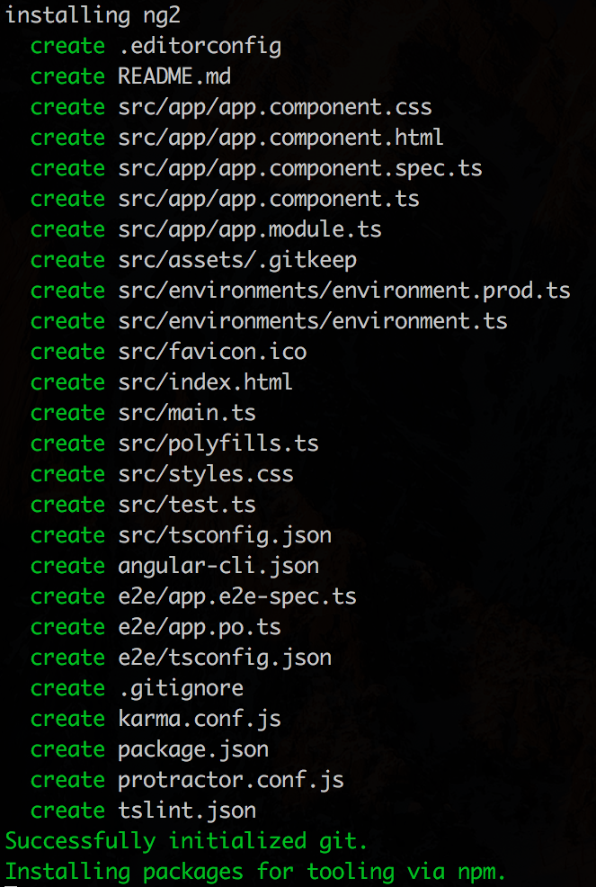
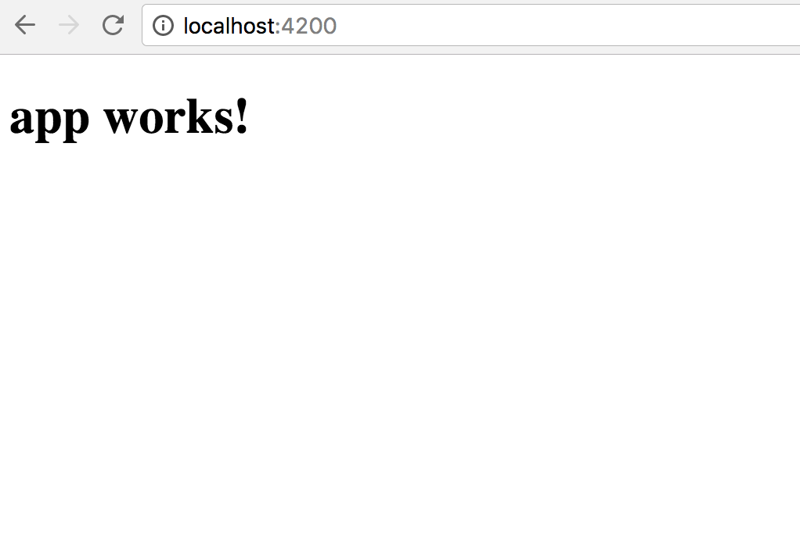
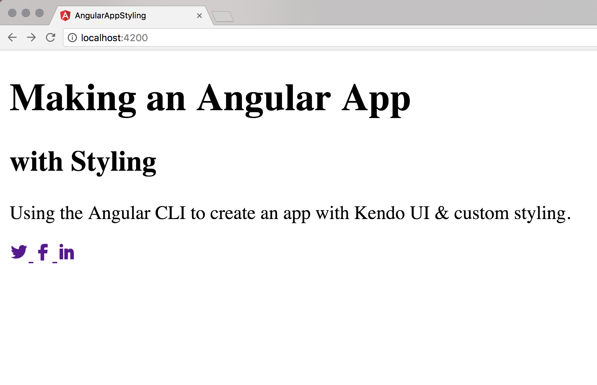
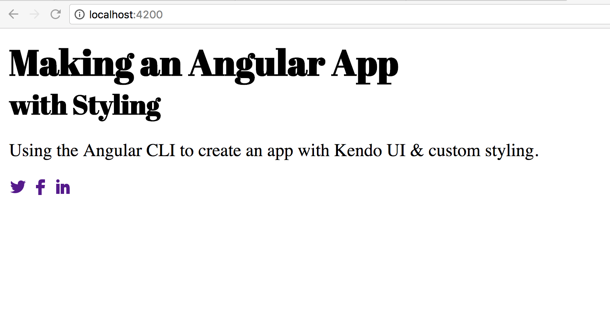
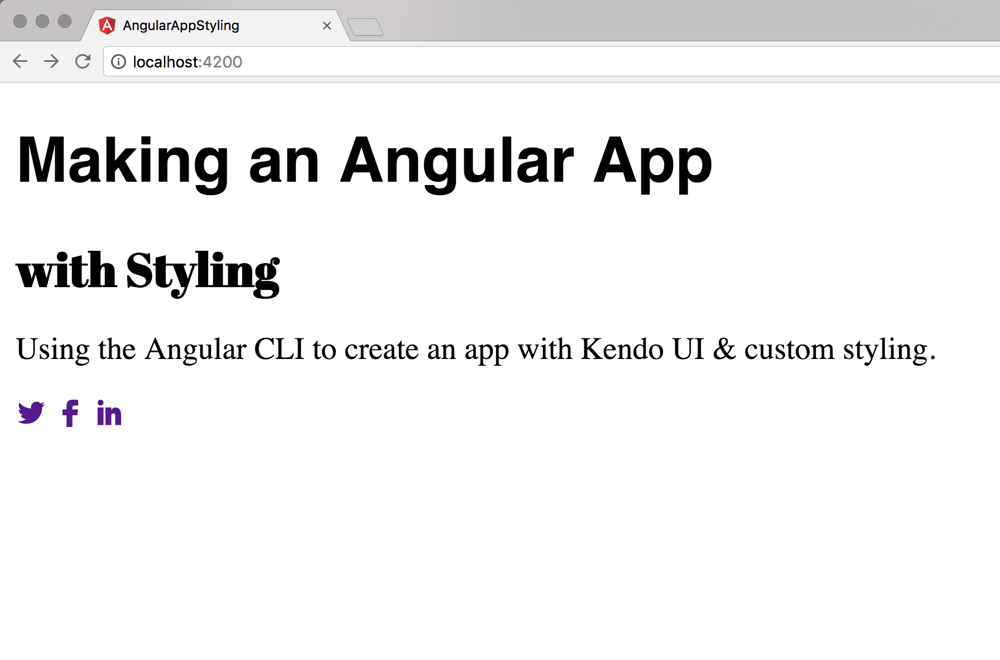
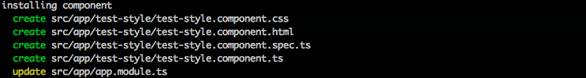
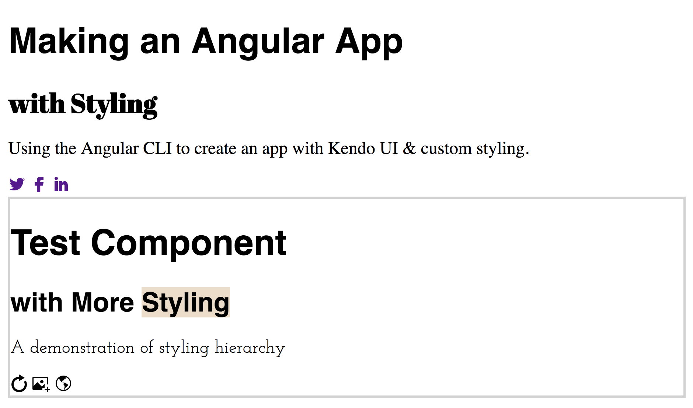

# How to Make an Angular App
## with Kendo UI && Custom Styling

One of the biggest hurdles to creating your projects can be getting from zero to running project. Using the [Angular CLI](https://cli.angular.io/) makes that process painless and fast. In this post we'll get a project skeleton together using the Angular CLI and then add some base styling with the [Kendo UI for Angular default theme](http://www.telerik.com/kendo-angular-ui/components/styling/) along with our own custom styling. Kendo UI's default theme gives us a great base for rendering attractive components without having to spend any time or effort. Then if we want to customize the color scheme, it's just a matter of re-assigning a variable. We'll also look at how styling is implemented across the different components in an Angular app to understand the style hierarchy in the app.

#### Project Files
You can follow the process of creating this project using the [angular-app-styling repo](https://github.com/tzmanics/angular-app-styling). At the end of each section I will reference the commit that matches up with the code changes we just made. Let's get started!

### Creating an Angular App with the Angular CLI
To use the Angular CLI we'll first need to install it using npm. We'll install it globally using the `-g` flag so that we can use it anywhere in our shell.

```bash
npm install -g angular-cli
```
After the CLI is installed we can create an new Angular application using the `ng new <project name>` command and use the `--style` flag to create global and component stylesheets as sass files. We'll also move into the project's directory once the project is created.

```bash
ng new angular-app-styling --style=scss && cd angular-app-styling
```


_The output shows all the files that are being created for your app._

✨TA-DA!✨ We now have a working Angular application. To take a look at the application, we can run the `ng serve` command from anywhere in the project directory. In our browser we go to `http://localhost:4200/` where our application is being served up and we get to see the always confidence-boosting 'app works!'.


_We did it! 😋_

You can leave `ng serve` running now and as you make changes in your project files your app will update. I like to `ctrl + c` out of that process and set up the project's git repository. To do so, we just create a repository on your git hosting site (today we're using [Github](https://github.com/)) and assign the repository's url to where the project should `push` and `fetch`. We'll do this using the `git remote` commands then push the contents to that repository.

```bash
  git remote add origin https://github.com/tzmanics/angular-app-styling
  git push origin master
```
[Initial file dump commit](https://github.com/tzmanics/angular-app-styling/commit/ba0d5ba8aaccd8252a8d5e4117b9e912c64e07df)

Now we have a working site AND a point we can go back to if we find that somehow everything got borked!


### It's Stylin' Time!

Today we'll only be editing the `styles.scss` and `app` directory files in the `src` directory. Right now the file structure of the files we'll be using looks like this:

```
  - src
    styles.scss
    - app
      app.component.html
      app.component.scss
      app.component.spec.ts
      app.component.ts
      app.module.ts
```

To add the Kendo UI default theme we will first need to install it and use the `-S` or `--save` flag to add it to our project's `package.json` list of dependencies.

```bash
  npm i -S @progress/kendo-theme-default
```

#### Adding the Theme to the Main Component file

To implement the theme we can add the file directly to our main component file. We'll also change the app title while we're here.

`src/app/app.component.ts`
```ts
  import { Component } from '@angular/core';

  @Component({
    selector: 'app-root',
    templateUrl: './app.component.html',
    styleUrls: [ '../../node_modules/@progress/kendo-theme-default/dist/all.css' ]
  })
  export class AppComponent {
    title = 'Making an Angular App';
  }
```

Let's go ahead and add some HTML content to our app so that we can see how everything looks. We'll add some text and we'll take advantage of Kendo UI's [web font icons](http://www.telerik.com/kendo-angular-ui/components/styling/icons/). These are over 400 integrated font icons which is really great not only for all the social media icons but also to keep a nice uniform theme for image & text editing, navigation, actions, alerts and more.

`src/app/app.component.html`
```ts
  <h1>
    {{title}}
  </h1>
  <h2> with Styling </h2>
  <p>
    Using the Angular CLI to create an app with Kendo UI &amp; custom styling.
  </p>

  <a href="https://twitter.com/KendoUI">
    <span class="k-icon k-i-twitter"></span>
  </a>

  <a href="https://www.facebook.com/KendoUI/">
    <span class="k-icon k-i-facebook"></span>
  </a>

  <a href="https://www.linkedin.com/topic/kendo-ui">
    <span class="k-icon k-i-linkedin"></span>
</a>

```
[Link to commit adding Kendo UI default theme and HTML content](https://github.com/tzmanics/angular-app-styling/commit/d4880edfb140d2a53721ff4e9a5ff19d8f786c5a)

We can see that with the Kendo UI styling we have lovely social icons. It looks like there `text-decorations` on our links though, so let's figure out a way to add some custom styling tweaks.



#### Importing the Kendo UI Theme and Adding Custom Styling

Instead of directly linking the Kendo UI default theme to our main component we'll revert back to calling on the `app.component.scss` file in the component's `styleUrls` property. In that file we'll import the Kendo UI default theme and add some custom changes as well.

`src/spp/app.component.ts`
```ts
  import { Component } from '@angular/core';

  @Component({
    selector: 'app-root',
    templateUrl: './app.component.html',
    styleUrls: [ './app.component.scss' ]
  })
  export class AppComponent {
    title = 'Making an Angular App';
  }
```  

`src/app/app.component.scss`
```scss
  @import "~@progress/kendo-theme-default/scss/all";
  @import url('https://fonts.googleapis.com/css?family=Abril+Fatface');

  a {
    text-decoration: none;
  }

  h1, h2 {
    font-family: 'Abril Fatface', cursive;
    margin-top: 0;
    margin-bottom: 0;
  }
```
[Custom styling commit](https://github.com/tzmanics/angular-app-styling/commit/97ac28bf07b3dc274bbbe7b170dffdb2135763b1)

Now when we take a look we have the default theme in place, the dashes in `text-decoration` are gone plus we have fancy `h1` & `h2` fonts. So fancy.




You can also customize the Kendo UI default theme to your own style by changing the variable values before importing the theme. Check out the [repo](https://github.com/telerik/kendo-theme-default) to see all the different variables you can use. Here's what that would look like in the sass file.

```sass
  $widget-bg: #ffffcc;
  $button-pressed-gradient: #d0cfce;
  $accent: #aeddc7;

  @import "~@progress/kendo-theme-default/scss/all";
```

But what if we want this styling to apply to every component in our application?

#### Global Styling and Component Styling

The Angular CLI provides us with a `styles.scss` file in the `src` directory. All the styles in this file will be applied to every component in our file. Let's see how this works by adding out Kendo UI default theme to the `styles.scss` file then making some edits to the main `app.component.scss` file.

First, we'll move the Kendo UI default theme import to the global stylesheet and style our `h1` and `h2`. Then in the main component stylesheet we'll overwrite the `h2` styling to see which style prevails.

`src/styles.scss`
```ts
/* You can add global styles to this file, and also import other style files */
  @import "~@progress/kendo-theme-default/scss/all";

  h1, h2 {
    font-family: Helvetica, sans-serif;
  }
```

`src/app/app.component.scss`
```ts
  @import url('https://fonts.googleapis.com/css?family=Abril+Fatface');

  a {
    text-decoration: none;
  }

  h2 {
    font-family: 'Abril Fatface', cursive;
    margin-top: 0;
    margin-bottom: 0;
  }
```

If we take a look now we can see that the app used the global styling everywhere but implemented the `h2` styling that was declared in the main component file. So, styling using the components stylesheet overrides the styles declared in the global stylesheet.



[Adding global styling commit](https://github.com/tzmanics/angular-app-styling/commit/82e50defc2f879bbdc1f7471e469ca78b9a4545b)

#### Styling Other components

One more rabbit hole we can go down is to see what happens if we add another component, styling beyond just the main app component. Although you _can_ make an application just using the main component...we don't want to do that. We'll take advantage of the Angular CLI to generate a new component to test. This will create all the files needed for the new component and import it in our `app.module.ts` file.

```bash
  ng g component test-style
```


The only thing we have to do to include our new component is add its selector to our main HTML file.

`src/app/app.component.html`
```ts
  <h1>
    {{title}}
  </h1>
  <h2> with Styling </h2>
  <p>
    Using the Angular CLI to create an app with Kendo UI &amp; custom styling.
  </p>

  <a href="https://twitter.com/KendoUI">
    <span class="k-icon k-i-twitter"></span>
  </a>

  <a href="https://www.facebook.com/KendoUI/">
    <span class="k-icon k-i-facebook"></span>
  </a>

  <a href="https://www.linkedin.com/topic/kendo-ui">
      <span class="k-icon k-i-linkedin"></span>
  </a>

  <app-test-style></app-test-style>
```

To see how the styling hierarchy works with another component we'll add some  content to the component's HTML and some different styling to its sass file.

`src/app/test-style/test-style.component.html`
```ts
  <h1> Test Component </h1>
  <h2> with More Styling </h2>
  <p> A demonstration of styling hierarchy </p>

  <span class="k-icon k-i-reload"></span>
  <span class="k-icon k-i-image-light-dialog"></span>
  <span class="k-icon k-i-globe-outline"></span>
```

`src/app/test-style/test-style.component.scss`
```sass
  @import url('https://fonts.googleapis.com/css?family=Amatic+SC|Josefin+Slab');

  :host {
    display: block;
    border: solid 2px lightgray;
  }

  p {
    font-family: 'Josefin Slab', serif;
  }
```

In this component's sass file we used the [`:host` psuedo-class selector](https://angular.io/docs/ts/latest/guide/component-styles.html#!#-host) to showcase the new content by wrapping a border around it. We use this to target the styles of the element that is _hosting_ the component we're in (i.e. not the elements _inside_ the component). The actual contents we want to wrap a border around (`app-test-style`) lives in the main component and `:host` is the only way to reach the contents of the other (main) component.


Let's see how that worked out.


[Additional component and styling commit](https://github.com/tzmanics/angular-app-styling/commit/60b06b8f702315734fdcff942551129845da8d18#diff-569751f80b023bbe6c032d88e02958ca)

Again, the stylesheet tied to each component dictated how the elements were displayed for that component. Since only `p` element was changed in this new component, its `h1` and `h2` elements were styled using the global stylesheet (`app/styles.scss`). Notice how the `h2` element was not changed by the main component's style sheet. Also, since the Kendo UI default theme is in the global stylesheet we can still use the web font icons 🤘.

### Wrrrrrap it Up

Angular CLI lets you make an Angular app very quickly and easily. Styling, on the other hand, is notoriously not easy.


_just kind of_

You don't have to bother with styling any of your Kendo UI components if you don't want to. Plus, you get a ton of icons that you don't have to search for, edit or style! That part alone is pretty exciting.

We'll be using this as our skeleton as we work through adding all of our components to build a larger web application. Check in soon for the next installment when we implement the [Grid component](http://www.telerik.com/kendo-angular-ui/components/grid/)!

Thanks for coding with me! ✌️
